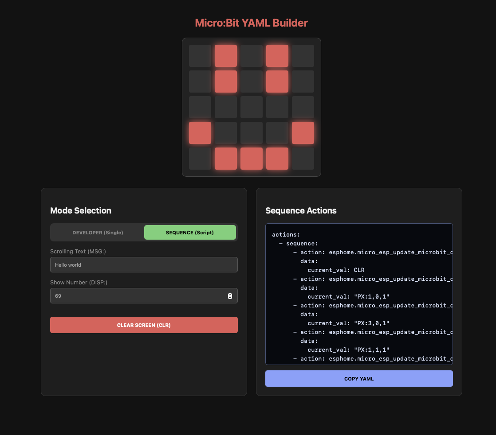

# Micro-ESP
Bridge a micro:bit display and buttons to Home Assistant through an ESP32-C3 running ESPHome.

## Screenshots

## Features
- Sends commands from ESPHome to micro:bit over UART:
  - draw/clear pixels on the 5x5 LED matrix
  - show numbers
  - scroll text
  - trigger a simple connection test icon
- Reports micro:bit button A/B state back to ESPHome as binary sensors.

## To Get Started

### Hardware
To build this project, you will need the following components:
* **Microcontrollers:** ESP32-C3 & micro:bit

#### Wiring
* ESP32 `GPIO21` (TX) -> micro:bit `P1`
* ESP32 `GPIO20` (RX) -> micro:bit `P0`
* GND -> GND

### Software
1. Flash [`firmware/makecode/main.py`](firmware/makecode/main.py) to your micro:bit using [Makecode](https://makecode.microbit.org/).
2. Download or copy the configuration file located at [`firmware/esphome/micro-esp.yaml`](firmware/esphome/micro-esp.yaml) into your ESPHome environment.
3. Flash the firmware onto your ESP32-C3.

## Command Protocol
All commands are newline-terminated (`\n`).

* `PX:x,y,v` — Set pixel at coordinates `(x,y)`, where `v=1` turns the pixel on and `v=0` turns it off.
* `CLR` — Clear the display.
* `DISP:n` — Show a number or static text using `show_string`.
* `MSG:text` — Scroll text across the screen.
* `INC` — Show a checkmark/YES icon (used as a quick UART communication test).

## Using the YAML Builder
Use [microesp.rioli.app](https://microesp.rioli.app) to generate Home Assistant action YAML:
- Draw pixels on a 5x5 grid
- Toggle between single command and sequence mode
- Generate `MSG:` and `DISP:` payloads
- Copy YAML to clipboard

## FAQ

#### Did you use AI?
Yes, I used Google Gemini to fix my grammar of this README.md file and help generate the website and code. **But** I reviewed and tested everything before uploading it to GitHub.

#### Why this?
I had two unused micro:bits at home and wanted to integrate them into my smart home, but I couldn't find an existing solution .

## Feedback
If you have any feedback, please reach out to me at **Work@rioli.net**

## Acknowledgements
 - [Readme.so Github](https://github.com/octokatherine/readme.so)
 - [ESPHome Github](https://github.com/esphome/esphome)